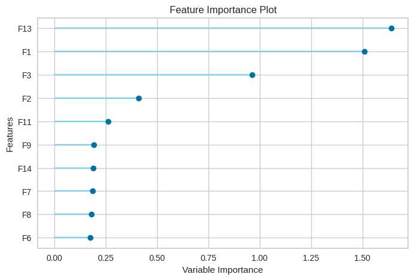

# lab-eval

This document summarizes the performance of various regression models evaluated on a dataset. The performance metrics include **Mean Absolute Error (MAE)**, **Mean Squared Error (MSE)**, **Root Mean Squared Error (RMSE)**, **R-squared (R²)**, **Root Mean Squared Logarithmic Error (RMSLE)**, and **Mean Absolute Percentage Error (MAPE)**.

| Model | MAE   | MSE     | RMSE   | R²     | RMSLE  | MAPE   |
|-------|-------|---------|--------|--------|--------|--------|
| **br**    | Bayesian Ridge            | 4.0207 | 22.8357 | 4.7733 | 0.1838 | 0.0695 | 0.0595 |
| **ridge** | Ridge Regression          | 4.0360 | 22.9235 | 4.7822 | 0.1802 | 0.0696 | 0.0597 |
| **lr**    | Linear Regression         | 4.0365 | 22.9278 | 4.7826 | 0.1800 | 0.0696 | 0.0597 |
| **lar**   | Least Angle Regression    | 4.0365 | 22.9278 | 4.7826 | 0.1800 | 0.0696 | 0.0597 |
| **huber** | Huber Regressor           | 4.0846 | 23.4563 | 4.8358 | 0.1623 | 0.0704 | 0.0605 |
| **ada**   | AdaBoost Regressor        | 4.1137 | 23.9462 | 4.8909 | 0.1429 | 0.0712 | 0.0609 |
| **et**    | Extra Trees Regressor     | 4.1571 | 24.2408 | 4.9196 | 0.1333 | 0.0716 | 0.0615 |
| **en**    | Elastic Net               | 4.1105 | 24.4023 | 4.9355 | 0.1297 | 0.0719 | 0.0609 |
| **rf**    | Random Forest Regressor   | 4.1481 | 24.5485 | 4.9471 | 0.1227 | 0.0719 | 0.0614 |
| **lasso** | Lasso Regression          | 4.1548 | 25.0182 | 4.9967 | 0.1081 | 0.0728 | 0.0616 |
| **llar**  | Lasso Least Angle Regression | 4.1548 | 25.0182 | 4.9967 | 0.1081 | 0.0728 | 0.0616 |
| **gbr**   | Gradient Boosting Regressor | 4.3508 | 27.0451 | 5.1918 | 0.0359 | 0.0755 | 0.0643 |
| **lightgbm** | Light Gradient Boosting Machine | 4.3671 | 27.6380 | 5.2453 | 0.0162 | 0.0764 | 0.0646 |
| **knn**   | K Neighbors Regressor     | 4.3901 | 27.7899 | 5.2581 | 0.0128 | 0.0764 | 0.0648 |
| **omp**   | Orthogonal Matching Pursuit | 4.3507 | 27.6300 | 5.2486 | 0.0106 | 0.0765 | 0.0645 |
| **xgboost** | Extreme Gradient Boosting | 4.4327 | 29.1035 | 5.3839 | -0.0379 | 0.0784 | 0.0656 |
| **dummy** | Dummy Regressor           | 4.4220 | 29.3158 | 5.4092 | -0.0431 | 0.0788 | 0.0656 |
| **par**   | Passive Aggressive Regressor | 5.6201 | 46.1473 | 6.7653 | -0.6317 | 0.0987 | 0.0826 |
| **dt**    | Decision Tree Regressor   | 5.7493 | 47.9221 | 6.9062 | -0.7062 | 0.1003 | 0.0848 |

---

### Model Insights

- **Best Performers**:  
    - **Bayesian Ridge** is the standout with the lowest errors and decent **R²** (~18%). It’s the most reliable model here.
    - **Ridge Regression** and **Linear Regression** are almost as good but slightly lag behind Bayesian Ridge.

- **Weakest Models**:  
    - **Passive Aggressive Regressor** and **Decision Tree Regressor** both have negative **R²**, meaning they aren't explaining the variance in the target variable well.

- **Complex Models**:  
    - **Gradient Boosting**, **LightGBM**, and **XGBoost** didn't perform as expected, possibly due to overfitting or lack of tuning.

---

### Feature Importance for Bayesian Ridge

